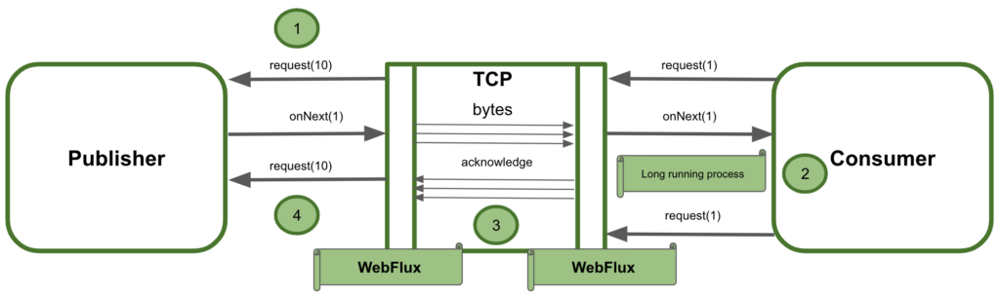

# Reactive Programming in Spring Framework

[Note](https://docs.spring.io/spring-framework/docs/current/reference/html/web-reactive.html#webflux)


The reactive-stack web framework, Spring WebFlux, was added later in version 5.0  
- It is fully non-blocking, supports Reactive Streams back pressure, and runs on such servers as Netty, Undertow, and Servlet 3.1+ containers.

The original web framework included in the Spring Framework, **Spring Web MVC, was purpose-built for the Servlet API and Servlet containers.**

## (Applicability) Spring MVC or WebFlux?

1. If you have a Spring MVC application that works fine, there is no need to change.   

2. **If you are already shopping for a non-blocking web stack**, Spring WebFlux offers the same execution model benefits as others in this space and also provides a choice of servers (Netty, Tomcat, Jetty, Undertow, and Servlet 3.1+ containers), a choice of programming models (annotated controllers and functional web endpoints), and a choice of reactive libraries (Reactor, RxJava, or other).

3. **If you are interested in a lightweight, functional web framework for use with Java 8 lambdas or Kotlin**
    - you can use the Spring WebFlux functional web endpoints. That can also be a good choice for smaller applications or microservices with less complex requirements that can benefit from greater transparency and control.

4. In a microservice architecture, you can have a mix of applications with either Spring MVC or Spring WebFlux controllers or with Spring WebFlux functional endpoints. 
    - Having support for the same annotation-based programming model in both frameworks makes it easier to re-use knowledge while also selecting the right tool for the right job.

5. **A simple way to evaluate an application is to check its dependencies.** 
    - If you have blocking persistence APIs (JPA, JDBC) or networking APIs to use, Spring MVC is the best choice for common architectures at least. It is technically feasible(MACHBAR) with both Reactor and RxJava to perform blocking calls on a separate thread but you would not be making the most of a non-blocking web stack.


- **If you have a Spring MVC application with calls to remote services, try the reactive WebClient** 
    > (The greater the latency per call or the interdependency among calls, the more dramatic the benefits.). 
    - You can return reactive types (Reactor, RxJava, or other) directly from Spring MVC controller methods. 
    - Spring MVC controllers can call other reactive components too.

> Latency or network delay is the **overall amount of time it takes for information to be transmitted from the source to the destination** in a data network. Latency can affect the interaction between the participants on the call.

- **If you have a large team**, keep in mind the steep learning curve in the shift to non-blocking, functional, and declarative programming. 
    - A practical way to start without a full switch is to use the reactive WebClient.

## BackPressure in WebFlux

  

- WebFlux uses TCP flow control to regulate the backpressure in bytes. 
    - But it does not handle the logical elements the consumer can receive. 
    - Let's see the interaction flow happening under the hood:

- WebFlux framework is responsible for the conversion of events to bytes in order to transfer/receive them through TCP
    - It may happen that the consumer starts and long-running job before requesting the next logical element

- Due to the nature of the TCP protocol, if there are new events the publisher will continue sending them to the network

- Spring WebFlux does not ideally manage backpressure between the services interacting as a whole system. 


```java
@Test
public void whenRequestingChunks10_thenMessagesAreReceived() {
    Flux request = Flux.range(1, 50);

    request.subscribe(
      System.out::println,
      err -> err.printStackTrace(),
      () -> System.out.println("All 50 items have been successfully processed!!!"),
      subscription -> {
          for (int i = 0; i < 5; i++) {
              System.out.println("Requesting the next 10 elements!!!");
              subscription.request(10);
          }
      }
    );

    StepVerifier.create(request)
      .expectSubscription()
      .thenRequest(10)
      .expectNext(1, 2, 3, 4, 5, 6, 7, 8, 9, 10)
      .thenRequest(10)
      .expectNext(11, 12, 13, 14, 15, 16, 17, 18, 19, 20)
      .thenRequest(10)
      .expectNext(21, 22, 23, 24, 25, 26, 27 , 28, 29 ,30)
      .thenRequest(10)
      .expectNext(31, 32, 33, 34, 35, 36, 37 , 38, 39 ,40)
      .thenRequest(10)
      .expectNext(41, 42, 43, 44, 45, 46, 47 , 48, 49 ,50)
      .verifyComplete();
```


[RxJava Blocking and Non Blocking](https://www.baeldung.com/spring-webclient-resttemplate)

## `RestTemplate` Blocking Client

[Example](https://www.tpisoftware.com/tpu/articleDetails/2383)  

Under the hood, `RestTemplate` uses the Java Servlet API, which is based on the thread-per-request model.


Once the requests are getting bigger , their waiting for the results will pile up.  
Consequently, the application will create many threads, which will exhaust the thread pool or occupy all the available memory. We can also experience performance degradation because of the frequent CPU context (thread) switching.

- Each thread will block until the web client receives the response.    
- Each thread consuming some amount of memory and CPU cycles.


## `WebClient` Non-Blocking Client
```xml
<dependency>
    <groupId>org.springframework.boot</groupId>
    <artifactId>spring-boot-starter-webflux</artifactId>
</dependency>
```

On the other side, `WebClient` uses an asynchronous, non-blocking solution provided by the Spring Reactive framework.

While `RestTemplate` uses the caller thread for each event (HTTP call), `WebClient` will create something like a **task** for each event.   
Behind the scenes, the Reactive framework will **queue** those **tasks** and execute them only when the appropriate **response** is available.

> The Reactive framework uses an **event-driven (tasks)** architecture.  

It provides means to compose asynchronous logic through the Reactive Streams API.   
As a result, the reactive approach can process more logic while using fewer threads and system resources, compared to the synchronous/blocking method.


[WebClient](https://zhuanlan.zhihu.com/p/394438006)    
**[Sending HTTP requests with Spring WebClient](https://reflectoring.io/spring-webclient/)**   

[Spring WebFlux](https://iter01.com/576659.html)   
[Spring RestFul WebFlux](https://dassum.medium.com/building-a-reactive-restful-web-service-using-spring-boot-and-postgres-c8e157dbc81d)   
[Spring WebFlux 2](https://www.section.io/engineering-education/spring-webflux/)

