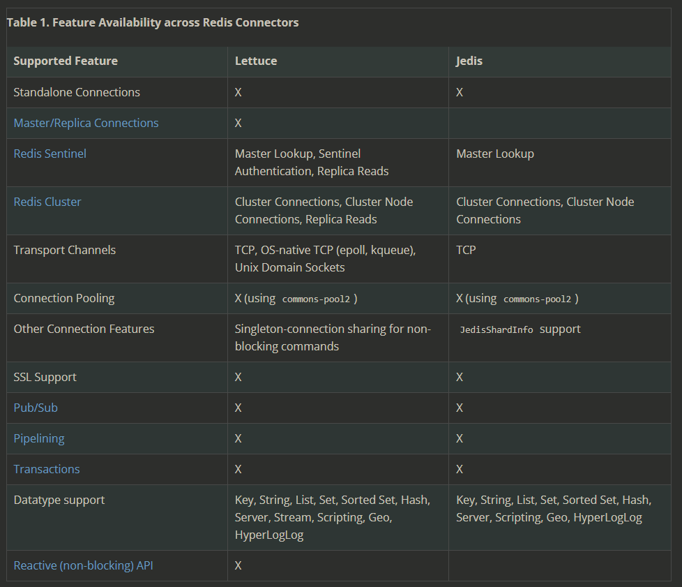
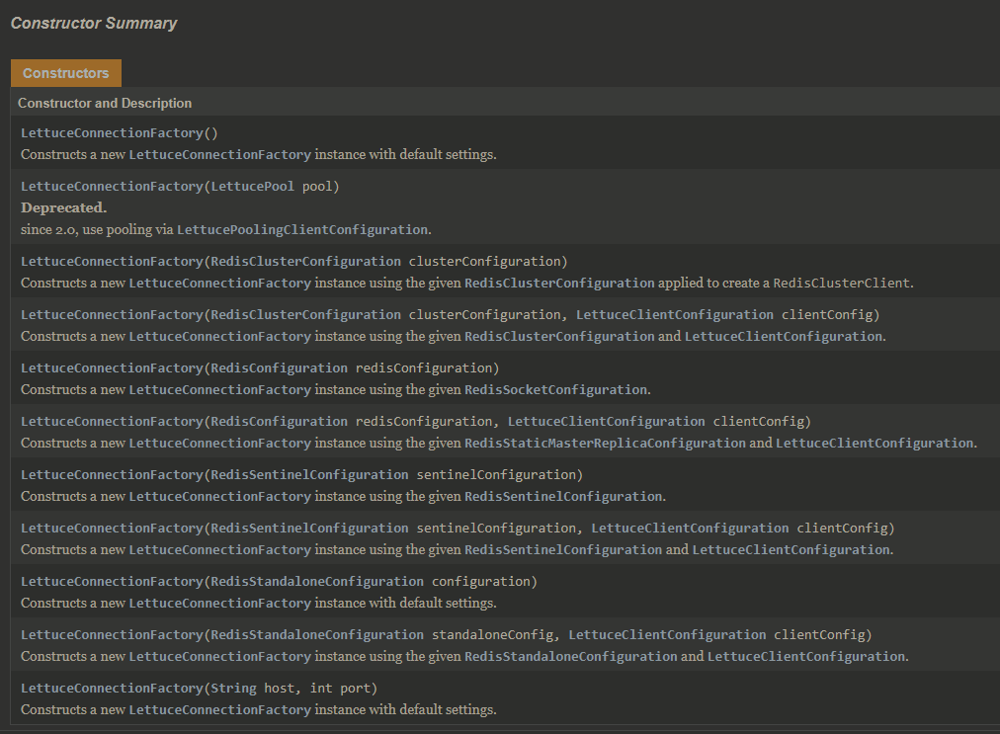
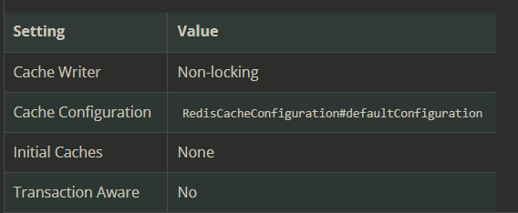
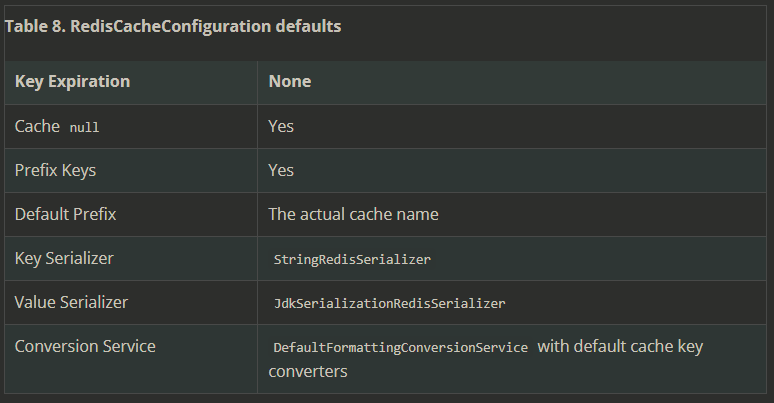
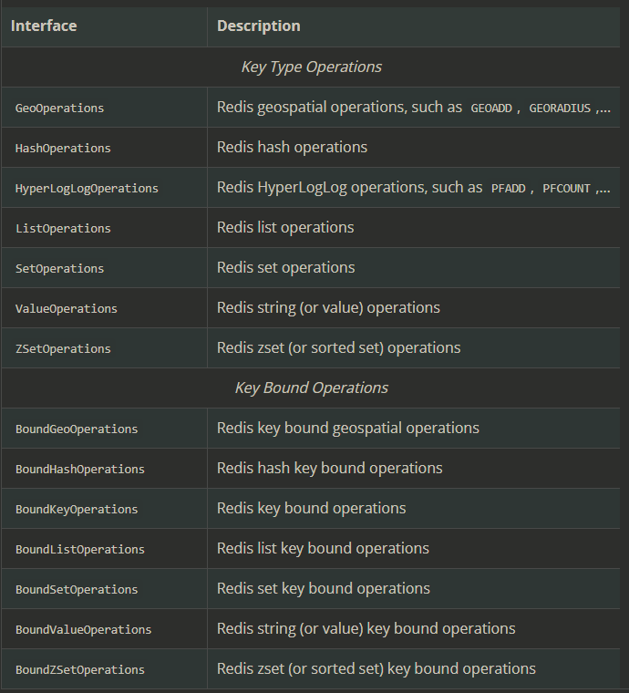

# Redis

**Redis Stands For Remote Dictionary Serve**

[TOC]
---
## References

[Code Example Ref](https://www.mindbowser.com/spring-boot-with-redis-cache-using-annotation/)     
[Code Example Ref 2](https://www.netsurfingzone.com/spring-boot/spring-boot-redis-cache-example/)     
[Code Example Ref 3](https://kumarshivam-66534.medium.com/implementation-of-spring-boot-data-redis-for-caching-in-my-application-218d02c31191)       
[Code Example Ref 4](https://medium.com/brucehsu-backend-dev/%E5%88%A9%E7%94%A8spring-cache%E5%84%AA%E9%9B%85%E7%9A%84%E4%BD%BF%E7%94%A8caches-5aad2630eb0a)  
[Spring Boot Cache with Redis](https://www.baeldung.com/spring-boot-redis-cache)    
[Install wsl window 10 and redis](https://redis.com/blog/redis-on-windows-10/)   
[Disable wsl window 10](https://www.windowscentral.com/install-windows-subsystem-linux-windows-10)   
[MatthewFTech spring-boot-cache-with-redis](https://medium.com/@MatthewFTech/spring-boot-cache-with-redis-56026f7da83a)   
**[Difference btw Lettuce and Jedis](https://github.com/spring-projects/spring-session/issues/789)**


---

## Dependency

```xml
<dependency>
    <groupId>org.springframework.boot</groupId>
    <artifactId>spring-boot-starter-data-redis</artifactId>
</dependency>
```


## application.properties

```vim
# **** REDIS (RedisProperties) ****
# **** spring.redis.XXXX       **** 

# Redis資料庫索引（預設為0）
spring.redis.database= 0

# Redis伺服器地址
spring.redis.host = localhost

# Redis伺服器連接端口
spring.redis.port = 6379

# Redis伺服器連接密碼（預設為空）
spring.redis.password =

# 連接池最大連接數（使用負值表示沒有限制）
spring.redis.pool.max-active = 8

# 連接池最大阻塞等待時間（使用負值表示沒有限制）
spring.redis.pool.max-wait = -1

# 連接池中的最大空閒連接
spring.redis.pool.max-idle = 8

# 連接池中的最小空閒連接
spring.redis.pool.min-idle = 0

# 連接超時時間（毫秒）
spring.redis.timeout = 1000
```


## Configuration

Redis Configuration in Java

```java
Cache(Factory(RedisServer))
```

1. Redis Server Configuration
2. Redis Connection Configuration
3. Redis As Cache Configuration
    > Cache Manager = Connection Factory Configuration + DataBase Server Configuration
4. Redis template Configuration


### 1. Redis Server Configuration behavior (`RedisCacheConfiguration`)

Configuration for Redis Database Cache (MOST USED)
[`RedisStandaloneConfiguration`](https://docs.spring.io/spring-data/redis/docs/2.3.0.RELEASE/api/index.html?org/springframework/data/redis/connection/RedisStandaloneConfiguration.html) 
- **this class used for setting up `RedisConnection` via `RedisConnectionFactory` using connecting to a single node Redis DataBase Cache installation.**
#### Prefix for `Key`

By default, **any key for a cache entry gets prefixed** with the actual cache name followed by two colons. This behavior can be changed to a `static` as well as a computed prefix.

```java
// static key prefix
RedisCacheConfiguration.defaultCacheConfig().prefixKeysWith("( ͡° ᴥ ͡°)");

//The following example shows how to set a computed prefix:

// computed key prefix
RedisCacheConfiguration.defaultCacheConfig().computePrefixWith(cacheName -> "¯\_(ツ)_/¯" + cacheName);
```

### 2. Connection Configuration 

`RedisConnection` provides the core building block for Redis communication, as it handles the communication with the Redis back end.

- It's something similar to `JdbcTemplate` to connect with `MySql` Server.


##### Redis connectors

Two features are supported 
1. Lettuce
2. Jedis
    > Both are the implementation of `RedisConnectionFactory`

  


The easiest way to work with a `RedisConnectionFactory` is to configure the appropriate connector through the IoC container (`@Configuration` , `＠bean`) and inject it (`@Autrowried`) into the using class.


Spring Redis provides an implementation for the Spring cache abstraction through the `org.springframework.data.redis.cache` package
```java 
@Bean
public RedisCacheManager cacheManager(RedisConnectionFactory connectionFactory) {
	return RedisCacheManager.create(connectionFactory);
}
```

#### Lettuce Connector


```xml
<dependency>
    <!-- ... -->

    <groupId>io.lettuce</groupId>
    <artifactId>lettuce-core</artifactId>
    <version>6.1.5.RELEASE</version>

</dependency>
```

A object of Connector 
```java
@Bean
  public LettuceConnectionFactory redisConnectionFactory() {

    return new LettuceConnectionFactory(new RedisStandaloneConfiguration("server", 6379));
  }
```
- To tweak settings such as the host or password via `RedisStandaloneConfiguration`
- By default, all LettuceConnection instances created by the `LettuceConnectionFactory` share the same thread-safe native connection for all non-blocking and non-transactional operations

  


##### Unix domain sockets

Lettuce integrates with Netty’s native transports, letting you use Unix domain sockets to communicate with Redis via `RedisSocketConfiguration`
```java
@Configuration
class AppConfig {

  @Bean
  public LettuceConnectionFactory redisConnectionFactory() {

    return new LettuceConnectionFactory(new RedisSocketConfiguration("/var/run/redis.sock"));
  }
}
```
#### Jedis Connector 

```xml
<dependency>

    <!-- ... -->    
    <groupId>redis.clients</groupId>
    <artifactId>jedis</artifactId>
    <version> ..... </version>  

</dependency>
```

```java
@Bean
public JedisConnectionFactory redisConnectionFactory() {
  return new JedisConnectionFactory();
}
```

To tweak settings via `RedisStandaloneConfiguration`
```java
@Configuration
class RedisConfiguration {

  @Bean
  public JedisConnectionFactory redisConnectionFactory() {

    RedisStandaloneConfiguration config = new RedisStandaloneConfiguration("server", 6379);
    return new JedisConnectionFactory(config);
  }
}
```
- [Redis:Sentinel](https://docs.spring.io/spring-data/data-redis/docs/current/reference/html/#redis:sentinel)

### 3. Cache Configuration for Redis 

**Cache Configuration = Behavior of Cache Provider in Cache Manager**
- **A `CacheManger` contains configuration of cache providers ( redis , caffeine ... ) for configuring each cache provider's Key, TTL, ... etc**

#### `RedisCacheManager`  Defaults
  


**The behavior of Redis Cache created with `RedisCacheManager` is defined with** [`RedisCacheConfiguration`](https://docs.spring.io/spring-data/redis/docs/current/api/org/springframework/data/redis/cache/RedisCacheConfiguration.html)
  

The `RedisCacheConfiguration` lets you set `Key` expiration `TTL`, `Prefixes`, and `Serializer` implementations for converting to and from the binary storage format
```java
var config = RedisCacheConfiguration.defaultCacheConfig() // <--- redisCacheConfiguration defaults
                                    .entryTtl(Duration.ofSeconds(1))
                                    .disableCachingNullValues();        
```
- Spring Boot will auto-configure a `RedisCacheManager` with default cache configuration. 

#### Configure Cache Manager Behavior for Redis

```java
@Configuration
@EnableCaching
public class CacheConfig {

    /**
      * <p> To create RedisCacheManager as An Cache Provider </p>
      * <p> RedisCacheManager must build 
            with Redis Connection Factory and 
      *     RedisCacheConfiguration </p>
      */
    @Bean
    public CacheManager redisCacheManager(RedisConnectionFactory redisConnectionFactory) {
        var redisCacheConfiguration = RedisCacheConfiguration.defaultCacheConfig()
                                                             .entryTtl(Duration.ofMinutes(30));
        
        // Cache Configuration
        return RedisCacheManager.builder(RedisCacheWriter
                                    .nonLockingRedisCacheWriter(redisConnectionFactory))
                                .cacheDefaults(redisCacheConfiguration)
                                .build();
    }
}
```
- [`serializeValuesWith`](https://stackoverflow.com/questions/48991608/how-to-use-spring-cache-redis-with-a-custom-resttemplate)
- [`RedisCacheConfiguration` Methods ](https://docs.spring.io/spring-data/redis/docs/current/api/org/springframework/data/redis/cache/RedisCacheConfiguration.html)

`RedisCacheManager` behavior can be configured with `RedisCacheManagerBuilder` 
```java
var cm = RedisCacheManager.builder(connectionFactory)
                          .cacheDefaults(defaultCacheConfig())
                          .withInitialCacheConfigurations(singletonMa(
                              "predefined", defaultCacheConfig().disableCachingNullValues()))
                          .transactionAware()
                          .build();
```

`RedisCacheManager` defaults to a lock-free `RedisCacheWriter` for reading and writing binary values. 
- **Lock-free caching improves throughput**. 
    - The lack of entry locking can lead to overlapping, non-atomic commands for the `putIfAbsent` and `clean` methods, as those require multiple commands to be sent to Redis. 
- the locking counterpart prevents command overlap by setting an explicit lock key and checking against presence of this key, which leads to additional requests and potential command wait times.

```java
RedisCacheManager cm = RedisCacheManager.build(RedisCacheWriter.lockingRedisCacheWriter())
	                                    .cacheDefaults(defaultCacheConfig())
	                                    ...
```

### 4. `RedisTemplate` Configuration

Configure `RedisTemplate` objects
- `RedisTemplate` objects can be used for querying data (get data, delete data , ... etc)

#### RedisTemplate's Serializer Types
They are implementation of `RedisSerializer<T>`    

- (DEFAULT) JDK (e.g.  key : `\xac\xed\x00\x05t\x00\x05KeyName`, value : `\xac\xed\x00\x05t\x00\x05Value` )
- **String (MOST USED)** ( e.g. `1 -> 1 `, `test -> test`)
- **JACKSON2JSON**  ( e.g. `2016 -> "2016"` )
- XML     

[Other built-in Serializer](https://stackoverflow.com/questions/31608394/get-set-value-from-redis-using-redistemplate)   
[Representation for each serializer](https://blog.csdn.net/weixin_44167627/article/details/108516013)   

```java
@Configuration
public class RedisConfig {

    // Connection Configuration
    @Bean
    @Primary
    public LettuceConnectionFactory redis1LettuceConnectionFactory(RedisStandaloneConfiguration redis1RedisConfig,
                                                                   GenericObjectPoolConfig redis1PoolConfig) {
        var clientConfig = LettucePoolingClientConfiguration.builder()
                           .commandTimeout(Duration.ofMillis(100))
                           .poolConfig(redis1PoolConfig).build();

        return new LettuceConnectionFactory(redis1RedisConfig, clientConfig);
    }

    // RedisTemplate
    @Bean
    public RedisTemplate<String, String> redis1Template(
            @Qualifier("redis1LettuceConnectionFactory") LettuceConnectionFactory redis1LettuceConnectionFactory) {
        
        RedisTemplate<String, String> redisTemplate = new RedisTemplate<>();

        // Key-Value
        redisTemplate.setKeySerializer(new StringRedisSerializer());
        redisTemplate.setValueSerializer(new GenericJackson2JsonRedisSerializer());

        // Hash Key-Value
        redisTemplate.setHashKeySerializer(new StringRedisSerializer());
        redisTemplate.setHashValueSerializer(new GenericJackson2JsonRedisSerializer());
        
        // Enable Transaction Support 
        redisTemplate.setEnableTransactionSupport(true);
        
        // Connection Factory
        redisTemplate.setConnectionFactory(redis1LettuceConnectionFactory);
        
        redisTemplate.afterPropertiesSet();

        return redisTemplate;
    }


    @Bean
    public RedisTemplate<String, Object> redisTemplate1(RedisConnectionFactory factory) throws UnknownHostException {
        
        // define <String , Object> as Key Pair
        RedisTemplate<String, Object> template = new RedisTemplate<String, Object>();
        template.setConnectionFactory(factory);
     
        // Create Json Serializer
        Jackson2JsonRedisSerializer jackson2JsonRedisSerializer = new Jackson2JsonRedisSerializer(Object.class);
        
        var objectMapper = new ObjectMapper();
        objectMapper.setVisibility(PropertyAccessor.ALL, JsonAutoDetect.Visibility.ANY);
        objectMapper.enableDefaultTyping(ObjectMapper.DefaultTyping.NON_FINAL);

        jackson2JsonRedisSerializer.setObjectMapper(objectMapper);

        // Create String Serializer
        StringRedisSerializer stringRedisSerializer = new StringRedisSerializer();

        /**
          * <p> Configure Template via String and Json Serializer 
          *     for Redis Template<.. , ..> to handle different Data Type</p>
          */

        // Keys whose data Type is String will serialize as String
        template.setKeySerializer(stringRedisSerializer);
        // Keys whose Data Type is hash will serialize as String 
        template.setHashKeySerializer(stringRedisSerializer);

        // Values ill serialize as jackson2Json
        template.setValueSerializer(jackson2JsonRedisSerializer);
        // Values of Hash will serialize as jackson2Json
        template.setHashValueSerializer(jackson2JsonRedisSerializer);

        //Commit The Above Properties 
        template.afterPropertiesSet();

        return template;

    }

    // Redis DataBase Cache Configuration
    @Configuration
    public static class Redis1Config {
        @Value("${spring.redis1.host}")
        private String host;
        @Value("${spring.redis1.port}")
        private Integer port;
        @Value("${spring.redis1.password}")
        private String password;
        @Value("${spring.redis1.database}")
        private Integer database;

        @Value("${spring.redis1.lettuce.pool.max-active}")
        private Integer maxActive;
        @Value("${spring.redis1.lettuce.pool.max-idle}")
        private Integer maxIdle;
        @Value("${spring.redis1.lettuce.pool.max-wait}")
        private Long maxWait;
        @Value("${spring.redis1.lettuce.pool.min-idle}")
        private Integer minIdle;

        // Connector Pool 
        @Bean
        public GenericObjectPoolConfig redis1PoolConfig() {
            GenericObjectPoolConfig config = new GenericObjectPoolConfig();
            config.setMaxTotal(maxActive);
            config.setMaxIdle(maxIdle);
            config.setMinIdle(minIdle);
            config.setMaxWaitMillis(maxWait);
            return config;
        }

        // Redis DataBase 
        @Bean
        public RedisStandaloneConfiguration redis1RedisConfig() {
            RedisStandaloneConfiguration config = new RedisStandaloneConfiguration();
            config.setHostName(host);
            config.setPassword(RedisPassword.of(password));
            config.setPort(port);
            config.setDatabase(database);
            return config;
        }
    }
}
```
- [`ObjectMapper`](https://www.baeldung.com/jackson-object-mapper-tutorial)


[Configuration Example with `CachingConfigurerSupport`](https://www.tpisoftware.com/tpu/articleDetails/1525)   
```java
@Configuration
@EnableCaching
public class RedisConfig extends CachingConfigurerSupport {

    // Connection Configuration
	@Bean
	public JedisConnectionFactory redisConnectionFactory() {

		return new JedisConnectionFactory();
	}


    // Custom keyGenerator
	@Bean
	public KeyGenerator wiselyKeyGenerator() {
		return new KeyGenerator() {
			@Override
			public Object generate(Object target, Method method, Object... params) {
                StringBuilder sb = new StringBuilder();
                
                // get class name
                sb.append(target.getClass().getName());
                // get method name
                sb.append(method.getName());
				
                // get other params
                for (Object obj : params) {
					sb.append(obj.toString());
				}
				
				return sb.toString();
			}
		};
	}
    
    
    // Redis Template Configuration ( Using Redis to query the data )
	@Bean
	public RedisTemplate<String, String> redisTemplate(RedisConnectionFactory factory) {

		RedisTemplate<String, String> redisTemplate = new RedisTemplate<String, String>();
		
        redisTemplate.setConnectionFactory(factory);
		return redisTemplate;
	}

    // Redis Cache Configuration ( Use Redis As Cache Provider ) 
	@Bean
	public CacheManager cacheManager(RedisConnectionFactory factory) {

		RedisSerializationContext.SerializationPair<Object> pair = RedisSerializationContext.SerializationPair
				.fromSerializer(new GenericJackson2JsonRedisSerializer());
                
		var defaultCacheConfig = RedisCacheConfiguration.defaultCacheConfig()
				                 .serializeValuesWith(pair) 
				                 .entryTtl(Duration.ofHours(1)); 

		return RedisCacheManager.builder(RedisCacheWriter.nonLockingRedisCacheWriter(factory))
				.cacheDefaults(defaultCacheConfig).build();

	}

}
```


## Multiple Redis Configuration

[Code Reference 1](https://www.bswen.com/2021/03/springboot-how-to-connect-multiple-redis-server.html)    
**[Code Reference 2](https://www.liujiajia.me/2021/5/25/spring-boot-multi-redis)**
[Code Reference 3 ](https://hsiehjenhsuan.medium.com/spring-boot-%E4%BD%BF%E7%94%A8-lettuce-%E8%A8%AD%E5%AE%9A%E5%A4%9A%E5%80%8B-redis-%E9%80%A3%E7%B7%9A-55307dc6a480)   
[Code Reference 4](https://programmer.help/blogs/spring-boot-configures-multiple-instances-of-redis-data-source-operation.html)
### Application Properties or YML

```yml
spring:
  redis:
    user:
      host: 127.0.0.1
      port: ${redis.port:6379}
      database: 10
      password: 
    role:
      host: 127.0.0.1
      port: ${redis.port:26379}
      database: 12
      password: 
```

```vim
spring.redis.host=localhost
spring.redis.port=6379
spring.redis.database=10

spring.redis2.host=localhost
spring.redis2.port=26379
spring.redis2.database=12
```

### Property Class for Different Redis Servers

```java
@Data
public class RedisCommonProperty {
    private String host;
    private int port;
    private int database;
}
```

```java
@Configuration
@ConfigurationProperties(prefix = "spring.redis")
public class Redis1Property extends RedisCommonProperty {
}
```

```java
@Configuration
@ConfigurationProperties(prefix = "spring.redis2")
public class Redis2Property extends RedisCommonProperty {
}
```

### Connection and `RedisTemplate` Configuration


```java
@Configuration
public class Redis1Configuration {

    @Autowired
    private Redis1Property redis1Property;

    @Primary
    @Bean(name = "redis1ConnectionFactory")
    public RedisConnectionFactory userRedisConnectionFactory() {
        JedisConnectionFactory redisConnectionFactory = new JedisConnectionFactory();
        redisConnectionFactory.setHostName(redis1Property.getHost());
        redisConnectionFactory.setPort(redis1Property.getPort());
        redisConnectionFactory.setDatabase(redis1Property.getDatabase());
        redisConnectionFactory.setPoolConfig(getPoolConfig());
        return redisConnectionFactory;
    }

    private JedisPoolConfig getPoolConfig() {
        JedisPoolConfig jedisPoolConfig = new JedisPoolConfig();
        jedisPoolConfig.setMaxIdle(8);
        jedisPoolConfig.setMinIdle(1);
        jedisPoolConfig.setMaxTotal(8);
        return jedisPoolConfig;
    }

    // ----------------------------------------------------------------------------//

    @Bean(name = "redis1StringRedisTemplate")
    public StringRedisTemplate userStringRedisTemplate(
        @Qualifier("redis1ConnectionFactory") RedisConnectionFactory cf)
    {    
        StringRedisTemplate stringRedisTemplate = new StringRedisTemplate();
        stringRedisTemplate.setConnectionFactory(cf);
        return stringRedisTemplate;
    }

    @Bean(name = "redis1RedisTemplate")
    public RedisTemplate userRedisTemplate(
        @Qualifier("redis1ConnectionFactory") RedisConnectionFactory cf) 
    {
        StringRedisTemplate stringRedisTemplate = new StringRedisTemplate();
        stringRedisTemplate.setConnectionFactory(cf);
        //setSerializer(stringRedisTemplate);
        return stringRedisTemplate;
    }

}

@Configuration
public class Redis2Configuration {
    @Autowired
    private Redis2Property redis2Property;

    private JedisPoolConfig getPoolConfig() {
        JedisPoolConfig jedisPoolConfig = new JedisPoolConfig();
        jedisPoolConfig.setMaxIdle(8);
        jedisPoolConfig.setMinIdle(1);
        jedisPoolConfig.setMaxTotal(8);
        return jedisPoolConfig;
    }


    @Bean(name = "redis2ConnectionFactory")
    public RedisConnectionFactory roleRedisConnectionFactory() {
        JedisConnectionFactory redisConnectionFactory = new JedisConnectionFactory();
        redisConnectionFactory.setHostName(redis2Property.getHost());
        redisConnectionFactory.setPort(redis2Property.getPort());
        redisConnectionFactory.setDatabase(redis2Property.getDatabase());
        redisConnectionFactory.setPoolConfig(getPoolConfig());
        return redisConnectionFactory;
    }

    @Bean(name = "redis2StringRedisTemplate")
    public StringRedisTemplate roleStringRedisTemplate(@Qualifier("redis2ConnectionFactory") RedisConnectionFactory cf) {
        StringRedisTemplate stringRedisTemplate = new StringRedisTemplate();
        stringRedisTemplate.setConnectionFactory(cf);
        return stringRedisTemplate;
    }

    @Bean(name = "redis2RedisTemplate")
    public RedisTemplate roleRedisTemplate(@Qualifier("redis2ConnectionFactory") RedisConnectionFactory cf) {
        StringRedisTemplate stringRedisTemplate = new StringRedisTemplate();
        stringRedisTemplate.setConnectionFactory(cf);
        //setSerializer(stringRedisTemplate);
        return stringRedisTemplate;
    }

}
```
---

We can also divide each configuration a part 
### 1. Connection Configuration with `RedisStandaloneConfiguration`

```java
import lombok.RequiredArgsConstructor;

import org.springframework.context.annotation.Bean;
import org.springframework.context.annotation.Configuration;
import org.springframework.context.annotation.Primary;
import org.springframework.data.redis.connection.RedisConnectionFactory;
import org.springframework.data.redis.connection.RedisStandaloneConfiguration;
import org.springframework.data.redis.connection.jedis.JedisConnectionFactory;

@Configuration
@RequiredArgsConstructor
public class MyRedisConnectionConfiguration {

    // import our Properties for redis 
    private final UserRedisProperty userRedisProperty;
    private final RoleRedisProperty roleRedisProperty;

    @Primary
    @Bean(name = "userRedisConnectionFactory")
    public RedisConnectionFactory userRedisConnectionFactory() {
        RedisStandaloneConfiguration redisConfiguration = new RedisStandaloneConfiguration();
        redisConfiguration.setHostName(userRedisProperty.getHost());
        redisConfiguration.setPort(userRedisProperty.getPort());
        redisConfiguration.setDatabase(userRedisProperty.getDatabase());
        redisConfiguration.setPassword(userRedisProperty.getPassword());
        return new JedisConnectionFactory(redisConfiguration);
    }

    @Bean(name = "roleRedisConnectionFactory")
    public RedisConnectionFactory roleRedisConnectionFactory() {
        RedisStandaloneConfiguration redisConfiguration = new RedisStandaloneConfiguration();
        redisConfiguration.setHostName(roleRedisProperty.getHost());
        redisConfiguration.setPort(roleRedisProperty.getPort());
        redisConfiguration.setDatabase(roleRedisProperty.getDatabase());
        redisConfiguration.setPassword(roleRedisProperty.getPassword());
        return new JedisConnectionFactory(redisConfiguration);
    }

}
```

### 2. Cache Configuration with `CachingConfigurerSupport `

```java
import org.springframework.beans.factory.annotation.Qualifier;
import org.springframework.cache.CacheManager;
import org.springframework.cache.annotation.CachingConfigurerSupport;
import org.springframework.cache.annotation.EnableCaching;
import org.springframework.context.annotation.Bean;
import org.springframework.context.annotation.Configuration;
import org.springframework.context.annotation.Primary;
import org.springframework.data.redis.cache.RedisCacheConfiguration;
import org.springframework.data.redis.cache.RedisCacheManager;
import org.springframework.data.redis.cache.RedisCacheWriter;
import org.springframework.data.redis.connection.RedisConnectionFactory;
import org.springframework.data.redis.serializer.GenericJackson2JsonRedisSerializer;
import org.springframework.data.redis.serializer.RedisSerializationContext;
import org.springframework.data.redis.serializer.StringRedisSerializer;

import java.time.Duration;

@Configuration
@EnableCaching
public class MyRedisCacheConfiguration extends CachingConfigurerSupport {

    @Primary
    @Bean(name = "userCacheManager")
    public CacheManager userCacheManager(@Qualifier("userRedisConnectionFactory") RedisConnectionFactory cf) {
        RedisCacheWriter redisCacheWriter = RedisCacheWriter.nonLockingRedisCacheWriter(cf);

        var cacheConfiguration = RedisCacheConfiguration.defaultCacheConfig()
                .serializeKeysWith(RedisSerializationContext
                        .SerializationPair.fromSerializer(new StringRedisSerializer()))
                .serializeValuesWith(RedisSerializationContext
                        .SerializationPair.fromSerializer(new GenericJackson2JsonRedisSerializer()))
                .entryTtl(Duration.ofMinutes(30));

        return new RedisCacheManager(redisCacheWriter, cacheConfiguration);
    }

    @Bean(name = "roleCacheManager")
    public CacheManager roleCacheManager(@Qualifier("roleRedisConnectionFactory") RedisConnectionFactory cf) {
        RedisCacheWriter redisCacheWriter = RedisCacheWriter.nonLockingRedisCacheWriter(cf);

        RedisCacheConfiguration cacheConfiguration = RedisCacheConfiguration.defaultCacheConfig()
                .serializeKeysWith(RedisSerializationContext
                        .SerializationPair.fromSerializer(new StringRedisSerializer()))
                .serializeValuesWith(RedisSerializationContext
                        .SerializationPair.fromSerializer(new GenericJackson2JsonRedisSerializer()))
                .entryTtl(Duration.ofMinutes(30));

        return new RedisCacheManager(redisCacheWriter, cacheConfiguration);
    }

}
```


### 3. RedisTemplate Configuration

```java
import lombok.RequiredArgsConstructor;
import org.springframework.beans.factory.annotation.Qualifier;
import org.springframework.context.annotation.Bean;
import org.springframework.context.annotation.Configuration;
import org.springframework.context.annotation.Primary;
import org.springframework.data.redis.connection.RedisConnectionFactory;
import org.springframework.data.redis.core.RedisTemplate;
import org.springframework.data.redis.core.StringRedisTemplate;
import org.springframework.data.redis.serializer.GenericJackson2JsonRedisSerializer;
import org.springframework.data.redis.serializer.StringRedisSerializer;

@Configuration
@RequiredArgsConstructor
public class RedisTemplateConfiguration {

    @Primary
    @Bean(name = "userStringRedisTemplate")
    public StringRedisTemplate userStringRedisTemplate(@Qualifier("userRedisConnectionFactory") RedisConnectionFactory cf) {
        return new StringRedisTemplate(cf);
    }

    @Primary
    @Bean(name = "userRedisTemplate")
    public RedisTemplate userRedisTemplate(@Qualifier("userRedisConnectionFactory") RedisConnectionFactory cf) {
        StringRedisTemplate stringRedisTemplate = new StringRedisTemplate(cf);
        setSerializer(stringRedisTemplate);
        return stringRedisTemplate;
    }

    @Bean(name = "roleStringRedisTemplate")
    public StringRedisTemplate roleStringRedisTemplate(@Qualifier("roleRedisConnectionFactory") RedisConnectionFactory cf) {
        return new StringRedisTemplate(cf);
    }

    @Bean(name = "roleRedisTemplate")
    public RedisTemplate roleRedisTemplate(@Qualifier("roleRedisConnectionFactory") RedisConnectionFactory cf) {
        StringRedisTemplate stringRedisTemplate = new StringRedisTemplate(cf);
        setSerializer(stringRedisTemplate);
        return stringRedisTemplate;
    }

    private void setSerializer(RedisTemplate<String, String> template) {
        template.setDefaultSerializer(new GenericJackson2JsonRedisSerializer());
        
        template.setKeySerializer(new StringRedisSerializer());
        
        template.setHashKeySerializer(new GenericJackson2JsonRedisSerializer());
        
        template.setValueSerializer(new GenericJackson2JsonRedisSerializer());
    }
}
```

### To use RedisTemplate in Service Layer 
```java
@RequiredArgsConstructor
@Service
@Slf4j
public class UserService{
    @Override
    @Cacheable(cacheNames = "user", cacheManager = "userCacheManager")
    public int getUser(int id) {
        log.info("return user id = {}", id);
        return id;
    }

    @Override
    @Cacheable(cacheNames = "role", cacheManager = "roleCacheManager")
    public int getRole(int id) {
        log.info("return role id = {}", id);
        return id;
    }
}

```
## Tips

- Define `TTLs` : Time-to-live (TTL), is the time span after which your Cache will be deleting an entry. If you want to fetch data only once a minute, just guard it with a` @Cacheable` Annotation and set the TTL to `1` minute.

- Implement Serializable: If you are adding an object in Redis cache then the object should implement a Serializable interface.

- Redis Cache Limits: When cache size reaches the memory limit, old data is removed to make a place for a new one. Although Redis is very fast, it still has no limits on storing any amount of data on a 64-bit system. **It can only store 3GB of data on a 32-bit system.**

- Never Call Cacheable Method from the same class: The reason is that Spring proxy the access to these methods to make the Cache Abstraction work. When you call it within the same class this Proxy mechanic is not kicking in. By this, you basically bypass your Cache and make it non-effective.

- Use `Lettuce`, If you need something highly scalable: `Lettuce` is a scalable thread-safe, non-blocking Redis client based on netty and Reactor. `Jedis` is easy to use and supports a vast number of Redis features, however, it is not thread-safe and needs connection pooling to work in a multi-threaded environment.


##  Querying Data through `RedisTemplate` Methods

`RedisTemplate` uses a Java-based serializer for most of its operations. 
- Any object written or read by the template is `serialized` and `deserialized` through Java

- The Redis modules provides two extensions to `RedisConnection` and `RedisTemplate`, respectively the `StringRedisConnection` (and its `DefaultStringRedisConnection` implementation) and `StringRedisTemplate` as a convenient one-stop solution for intensive String operations. 
- **In addition to being bound to String keys, the template and the connection use the `StringRedisSerializer` underneath, which means the stored keys and values are human-readable**


  
- `String` : `opsForValue`
- `List` : `opsForList`
- `Set` :  `opsForSet`
- `Hash` : `opsForHash`
- `Sorted set` : `opsForZSet`

[Code Example :: redisTemplate Methods](https://zhuanlan.zhihu.com/p/139528556)   
[Code Example :: Custom redisTemplate Utils](https://zhuanlan.zhihu.com/p/336033293)    
[Other Code Example](https://blog.csdn.net/qq_36781505/article/details/86612988)


```java
@Autowired
RedisTemplate<String,Object> redisTemplate;
​
/**
  * <p> redisTemplate for key </p>
  */

// Check if exist
String key = "example";
Boolean exist = redisTemplate.hasKey(key);

// set expired time for this key 
long time = 60;
redisTemplate.expire(key, time, TimeUnit.SECONDS); // (key , time , unit)

// get expired time for this key
Long expire = redisTemplate.getExpire(key, TimeUnit.SECONDS);

// delete via key
redisTemplate.delete(key);

/*************************
  * <p> optForHash </p>
  */
// save a hash key value pair
// via put(key, map_key, map_value) 
String key = "key_forCache";
String item = "map_key";
String value = "map_value";
redisTemplate.opsForHash().put(key, item, value);

// save a MAP object
String key = "key_forCache";
Map<String, String> maps = new Map<String, String>();
maps.put("map_key_1", "map_value_1");
maps.put("map_key_2", "map_value_2");
redisTemplate.putAll(key, maps);

// get entries of a bucket via hash
String key = "bucket_name"
Map<String, String> entries = redisTemplate.opsForHash().entries(key);

// get map's value 
String key = "key_forCache";
String item = "map_key_1";
Object value = redisTemplate.opsForHash().get(key, item); // return value map_value_1

// delete item via key
redisTemplate.opsForHash().delete(key, item);

// Check if entry/item exists via key
String key = "map_forCache";

String item = "map_key_1";
Boolean exist = redisTemplate.opsForHash().hasKey(key, item);

/****************
  * <p> Set </p>
  */

​// add values in the set whose name is cacheName
String key = "cacheName";
String value1 = "2";
String value2 = "1";
redisTemplate.opsForSet().add(key, value1, value2);


// get values of set
// [1,2]
Set<Object> members = redisTemplate.opsForSet().members(key);


// is value exists in set
String value = "2";
Boolean member = redisTemplate.opsForSet().isMember(key, value);
```


We can create RedisUtil to operate `RedisTemplate`
```java
/**
 * Custom RedisTemplate Methods 
 */
@Component
public final class RedisUtil {

    @Autowired
    private RedisTemplate<String, Object> redisTemplate;

    /**
     * Cache Expired Time
     */
    public boolean expire(String key, long time) {
        try {
            if (time > 0) {
                redisTemplate.expire(key, time, TimeUnit.SECONDS);
            }

            return true;
        } catch (Exception e) {
            e.printStackTrace();

            return false;
        }
    }

    /**
     * get expired time corresponding the key
     * @param key can't be null
     * @return seconds (0 means live forever)
     */
    public long getExpire(String key) {
        return redisTemplate.getExpire(key, TimeUnit.SECONDS);
    }


    /**
     * Check key if exists
     */
    public boolean hasKey(String key) {
        try {
            return redisTemplate.hasKey(key);
        } catch (Exception e) {
            e.printStackTrace();
            return false;
        }
    }


    /**
     * Delete the caches
     */
    @SuppressWarnings("unchecked")
    public void del(String... key) {
        if (key != null && key.length > 0) {
            if (key.length == 1) {
                redisTemplate.delete(key[0]);
            } else {
                redisTemplate.delete(CollectionUtils.arrayToList(key));
            }
        }
    }
```


#### Override `opsForValue`
```java
    /**
     * get cache via {@code key}
     */
    public Object get(String key) {
        return key == null ? null : redisTemplate.opsForValue().get(key);
    }

    /**
     * save the data in the cache
     * @return true if successes
     */
    public boolean set(String key, Object value) {
        try {
            redisTemplate.opsForValue().set(key, value);
            return true;
        } catch (Exception e) {
            e.printStackTrace();
            return false;
        }
    }


    /**
     * Set cache with TTL
     * @param time  seconds if 0 or <0 then this cache live forever
     * @return true成功 false 失败
     */

    public boolean set(String key, Object value, long time) {
        try {
            if (time > 0) {
                redisTemplate.opsForValue().set(key, value, time, TimeUnit.SECONDS);
            } else {
                set(key, value);
            }
            return true;
        } catch (Exception e) {
            e.printStackTrace();
            return false;
        }
    }


    /**
     * Increment the certain cache correspond to key
     * @param delta bigger than 0
     */
    public long incr(String key, long delta) {
        if (delta < 0) {
            throw new RuntimeException("delta can not be less then or equal to 0");
        }
        return redisTemplate.opsForValue().increment(key, delta);
    }


    /**
     * decrement
     * @param delta
     */
    public long decr(String key, long delta) {
        if (delta < 0) {
            throw new RuntimeException("delta must be bigger than 0");
        }
        return redisTemplate.opsForValue().increment(key, -delta);
    }
```

### Override `opsForHash`

```java
    /**
     * Override opsForHash().get(key, item)
     */
    public Object hget(String key, String item) {
        return redisTemplate.opsForHash().get(key, item);
    }

    /**
     * Get Entries for certain bucket
     */
    public Map<Object, Object> hmget(String key) {
        return redisTemplate.opsForHash().entries(key);
    }

    /**
     * (hset) Insert new entries
     */
    public boolean hmset(String key, Map<String, Object> map) {
        try {
            redisTemplate.opsForHash().putAll(key, map);
            return true;
        } catch (Exception e) {
            e.printStackTrace();
            return false;
        }
    }


    /**
     * HashSet with TTL
     */
    public boolean hmset(String key, Map<String, Object> map, long time) {
        try {
            redisTemplate.opsForHash().putAll(key, map);
            if (time > 0) {
                expire(key, time);
            }
            return true;
        } catch (Exception e) {
            e.printStackTrace();
            return false;
        }
    }


    /**
     * hset : key -> [item , value] -> [item , value] -> ....
     */
    public boolean hset(String key, String item, Object value) {
        try {
            redisTemplate.opsForHash().put(key, item, value);
            return true;
        } catch (Exception e) {
            e.printStackTrace();
            return false;
        }
    }

    /**
     * hset with TTL
     */
    public boolean hset(String key, String item, Object value, long time) {
        try {
            redisTemplate.opsForHash().put(key, item, value);
            if (time > 0) {
                expire(key, time);
            }
            return true;
        } catch (Exception e) {
            e.printStackTrace();
            return false;
        }
    }


    /**
     * delete entries via items corresponding to specific key
     *
     * @param key  Can Not Be NULL
     * @param item Can Not Be NULL
     */
    public void hdel(String key, Object... item) {
        redisTemplate.opsForHash().delete(key, item);
    }


    /**
     * Search specific item via key
     */
    public boolean hHasKey(String key, String item) {
        return redisTemplate.opsForHash().hasKey(key, item);
    }


    /**
     * increment 
     * @param by > 0
     */
    public double hincr(String key, String item, double by) {
        return redisTemplate.opsForHash().increment(key, item, by);
    }


    /**
     * decrement
     * @param by > 0
     */
    public double hdecr(String key, String item, double by) {
        return redisTemplate.opsForHash().increment(key, item, -by);
    }
```

### Override `opsForSet()`
```java
    /**
     * get all value in Set via key
     */
    public Set<Object> sGet(String key) {
        try {
            return redisTemplate.opsForSet().members(key);
        } catch (Exception e) {
            e.printStackTrace();
            return null;
        }
    }


    /**
     * search the value in Set via key
     */
    public boolean sHasKey(String key, Object value) {
        try {
            return redisTemplate.opsForSet().isMember(key, value);
        } catch (Exception e) {
            e.printStackTrace();
            return false;
        }
    }


    /**
     * Insert new values
     */
    public long sSet(String key, Object... values) {
        try {
            return redisTemplate.opsForSet().add(key, values);
        } catch (Exception e) {
            e.printStackTrace();
            return 0;
        }
    }


    /**
     * Insert new values with TTL
     */
    public long sSetAndTime(String key, long time, Object... values) {
        try {
            Long count = redisTemplate.opsForSet().add(key, values);
            if (time > 0)
                expire(key, time);
            return count;
        } catch (Exception e) {
            e.printStackTrace();
            return 0;
        }
    }


    /**
     * get Set Size via Key
     */
    public long sGetSetSize(String key) {
        try {
            return redisTemplate.opsForSet().size(key);
        } catch (Exception e) {
            e.printStackTrace();
            return 0;
        }
    }


    /**
     * Delete values in Set via Key
     */
    public long setRemove(String key, Object... values) {
        try {
            Long count = redisTemplate.opsForSet().remove(key, values);
            return count;
        } catch (Exception e) {
            e.printStackTrace();
            return 0;
        }
    }
```

### Override `opsForList()`
```java
    /**
     * get List Contents
     * @param start 
     * @param end   
     * <p> start : 0  and end : -1 means fetch all contents of this list </p>
     */
    public List<Object> lGet(String key, long start, long end) {
        try {
            return redisTemplate.opsForList().range(key, start, end);
        } catch (Exception e) {
            e.printStackTrace();
            return null;
        }
    }


    /**
     * get List.size via Key
     */
    public long lGetListSize(String key) {
        try {
            return redisTemplate.opsForList().size(key);
        } catch (Exception e) {
            e.printStackTrace();
            return 0;
        }
    }


    /**
     * get content in the list via key and index of this list
     * @param index -1 : last one , -2 second to last , ...
     */
    public Object lGetIndex(String key, long index) {
        try {
            return redisTemplate.opsForList().index(key, index);
        } catch (Exception e) {
            e.printStackTrace();
            return null;
        }
    }


    /**
     * add new content in list 
     */
    public boolean lSet(String key, Object value) {
        try {
            redisTemplate.opsForList().rightPush(key, value);
            return true;
        } catch (Exception e) {
            e.printStackTrace();
            return false;
        }
    }


    /**
     * add new content in list with TTL
     */
    public boolean lSet(String key, Object value, long time) {
        try {
            redisTemplate.opsForList().rightPush(key, value);
            if (time > 0)
                expire(key, time);
            return true;
        } catch (Exception e) {
            e.printStackTrace();
            return false;
        }

    }


    /**
     * add List of values in the list
     */
    public boolean lSet(String key, List<Object> value) {
        try {
            redisTemplate.opsForList().rightPushAll(key, value);
            return true;
        } catch (Exception e) {
            e.printStackTrace();
            return false;
        }

    }


    /**
     * add value in the list with TTL
     */
    public boolean lSet(String key, List<Object> value, long time) {
        try {
            redisTemplate.opsForList().rightPushAll(key, value);
            if (time > 0)
                expire(key, time);
            return true;
        } catch (Exception e) {
            e.printStackTrace();
            return false;
        }
    }


    /**
     * edit content via index of list and key
     */

    public boolean lUpdateIndex(String key, long index, Object value) {
        try {
            redisTemplate.opsForList().set(key, index, value);
            return true;
        } catch (Exception e) {
            e.printStackTrace();
            return false;
        }
    }


    /**
     * delete n values in this list
     * @param count number of deleted items
     * @param value 
     */

    public long lRemove(String key, long count, Object value) {
        try {
            Long remove = redisTemplate.opsForList().remove(key, count, value);
            return remove;
        } catch (Exception e) {
            e.printStackTrace();
            return 0;
        }
    }
}

```

## Hash Mapping 

We can achieve a more sophisticated mapping of structured objects by using Redis hashes. 

Use Cases
- Direct mapping, by using `HashOperations` and a serialize
- Using Redis Repositories
- Using `HashMapper` and `HashOperations`

> Hash mappers are converters of map objects to a `Map<K, V>`

```java
public class Person {
  String firstname;
  String lastname;

  // …
}

public class HashMapping {

  // query the data (Person)
  @Autowired
  HashOperations<String, byte[], byte[]> hashOperations;

  // mapping the data (Person)
  HashMapper<Object, byte[], byte[]> mapper = new ObjectHashMapper();

  // save
  public void writeHash(String key, Person person) {

    Map<byte[], byte[]> mappedHash = mapper.toHash(person);

    hashOperations.putAll(key, mappedHash);
  }

  // get 
  public Person loadHash(String key) {

    Map<byte[], byte[]> loadedHash = hashOperations.entries("key");
    
    return (Person) mapper.fromHash(loadedHash);
  }
}
```


#### `Jackson2HashMapper`

`Jackson2HashMapper` can map top-level properties as Hash field names and, optionally, flatten the structure.

For example nested data structure
```java
public class Person {
  String firstname;
  String lastname;
  Address address;  // nested <------------------------
  Date date;
  LocalDateTime localDateTime;
}

public class Address {
  String city;
  String country;
}
```

```vim
address : { "city" : "Castle Black", "country" : "The North" }

flatten the structure

address.city : Castle Black  
address.country : The North  
```

## `@Transactional` Support

For use this annotations by enabling explicitly transaction support for each `RedisTemplate` by setting `setEnableTransactionSupport(true)`

Enabling transaction support binds RedisConnection to the current transaction backed by a ThreadLocal. 

- If the transaction finishes without errors, the Redis transaction gets committed with `EXEC`, otherwise rolled back with `DISCARD`. 

Redis transactions are batch-oriented. Commands issued during an ongoing transaction are queued and only applied when committing the transaction.

Spring Data Redis distinguishes between read-only and write commands in an ongoing transaction.  
- Read-only commands, such as `KEYS`, are **PIPED** to a fresh (non-thread-bound) `RedisConnection` to allow reads. 
- Write commands are **QUEUED** by `RedisTemplate` and applied upon commit.

