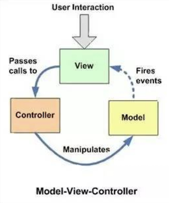
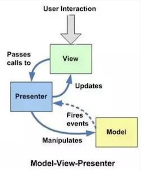
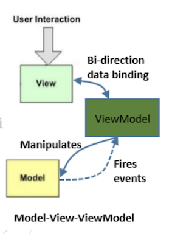

# MVC, MVP and MVVM
[Day 5 淺談 Android 設計架構 MVC、MVP、MVVM](https://ithelp.ithome.com.tw/articles/10218263)  

Model：管理資料來源如API和本地資料庫
View：顯示UI和接收使用者動作

ViewModel：從Model取得View所需的資料

## MVC

  

- Mode 跟 View 必須透郭 Controller 交流

## MVP

  
- Model 層拿到數據後，並不直接傳給 View 更新，而是交還給 Presenter，Presenter 再把數據交給 View，並更新畫面。

## MVVM(Observable

MVVM 用來解決MVC 還是 MVP，Presenter(Controller) 的代碼會越來越臃腫的問題  
透過觀察者模式將 View 和 Model 巧妙地連接在一起，一旦 Model 的數據發生變化，觀察者 View 就能夠感應到這個更動，並把數據更新到 UI 畫面上，ViewModel 甚至不需要持有 View 的引用，更方便進行單元測試。

  

優點
- 大幅減少代碼量，省去了 MVP 中用來連接彼此的介面，Model 層數據更新後也不必透過介面 callback 給 view，因為 View 會透過 observe 感知數據的變動並更新畫面  
- 可以搭配 DataBinding、LiveData 等框架使用，能更方便地處理 UI 的更新，生命週期的處理  
- ViewModel 能夠輕易地保存數據，且可以被多個 View 共享(MVC、MVP 也可以但較不適合)，View 與 View 之間傳遞數據也更方便(只有 MVVM 可以)
- 撰寫測試時，MVP 需要 Mock 一個 View 對象才能進行測試，由於 ViewModel 不需持有 View 的引用，更方便進行單元測試
