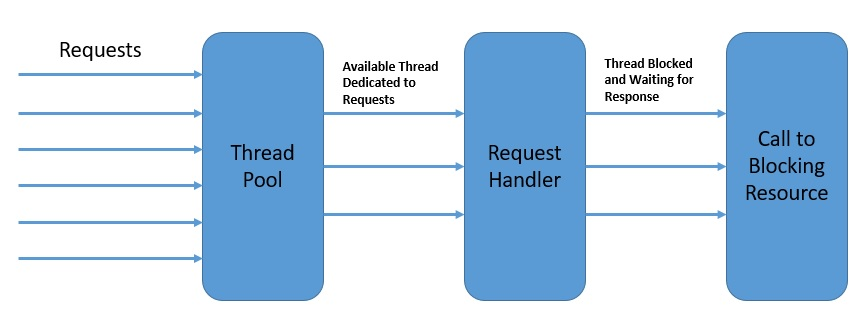

# Spring WebClient

Spring WebClient offers us using Handler & Router instead of spring mvc annotation-based

- [Blocking and Non Blocking](https://www.baeldung.com/spring-webclient-resttemplate)
- [Sending HTTP requests with Spring WebClient](https://reflectoring.io/spring-webclient/)
- [reactor functional web : router](https://www.baeldung.com/spring-5-functional-web)

## RestTemplate VS WebClient

### `RestTemplate` Blocking Client


[Example](https://www.tpisoftware.com/tpu/articleDetails/2383)  
[RestTemplate with Async](https://github.com/Odysseymoon/spring-webflux-template)

Under the hood, `RestTemplate` uses the Java Servlet API, which is based on the thread-per-request model.

Once the requests are getting bigger , their waiting for the results will pile up.  
Consequently, the application will create many threads, which will exhaust the thread pool or occupy all the available memory. We can also experience performance degradation because of the frequent CPU context (thread) switching.

- Each thread will block until the web client receives the response.    
- Each thread consuming some amount of memory and CPU cycles.


### `WebClient` Non-Blocking Client

```xml
<dependency>
    <groupId>org.springframework.boot</groupId>
    <artifactId>spring-boot-starter-webflux</artifactId>
</dependency>
```

On the other side, `WebClient` uses an asynchronous, non-blocking solution provided by the Spring Reactive framework.

While `RestTemplate` uses the caller thread for each event (HTTP call), `WebClient` will create something like a **task** for each event.   
Behind the scenes, the Reactive framework will **queue** those **tasks** and execute them only when the appropriate **response** is available.

> The Reactive framework uses an **event-driven (tasks)** architecture.  

It provides means to compose asynchronous logic through the Reactive Streams API.   
- As a result, the reactive approach can process more logic while using fewer threads and system resources, compared to the synchronous/blocking method.

  


## Reading the Body

To read the response body, we need to get a `Mono` (i.e: an async future value) for the contents of the response. 

We then need to unwrap that somehow, to trigger the request and get the response body content itself, once it’s available.

There are a few different ways to unwrap an asynchronous value. 

The simplest traditional option is by blocking to wait for the data to arrive
```java
String responseBody = responseSpec.bodyToMono(String.class)
//.block();
```
- This gives us a string containing the **raw** body of the response. 

- Note that we’re not checking the status here ourselves. When we use `.retrieve()`, the client automatically checks the status code for us, providing a sensible default by throwing an error for any 4xx or 5xx responses. 

## Send a http request

1. `WebClient` allows us to configure headers by either using dedicated methods for common cases `.contentType(type)` or generic keys and values `.header(key, value)`.

2. `.body()` with a BodyInserter, which will build body content for us from form values, multipart values, data buffers, or other encodeable types.

3. `.body()` with a Flux (including a Mono), which can stream content asynchronously to build the request body.

4. `.bodyValue(value)` to provide a string or other encodeable value directly.

```java
String response = client.post()
    .uri(new URI("https://httpbin.org/post"))
    .header("Authorization", "Bearer MY_SECRET_TOKEN")
    .contentType(MediaType.APPLICATION_FORM_URLENCODED)
    .accept(MediaType.APPLICATION_JSON)
    .body(BodyInserters.fromFormData(bodyValues))
    .retrieve()
    .bodyToMono(String.class)
    .block();
```

## Reading Response Header

```java
/**
  * {@code toEntity(String.class)}
  */
ResponseEntity<String> response = client.get()
    // ...
    .retrieve()
    .toEntity(String.class)
    .block();

HttpHeaders responseHeaders = response.getHeaders();

List<String> headerValue = responseHeaders.get("header-name");
```

## Parsing Response Bodies

Spring webClient can also automatically parse these into many higher-level types for the programmer, just by specifying a more specific type when reading the response, like so:
```java
Mono<Person> response = client.post()
    // ...
    .retrieve()
    .bodyToMono(Person.class)
```

Which classes can be converted depends on the HttpMessageReaders that are available. By default, the supported formats include:
- Conversion of any response to `String`, `byte[]`, `ByteBuffer`, `DataBuffer` or `Resource`
- Conversion of `application/x-www-form-urlencoded` responses into `MultiValueMap<String,String>>`
- Conversion of `multipart/form-data` responses into `MultiValueMap<String, Part>`
- Deserialization of `JSON` data using `Jackson`, if available
- Deserialization of `XML` data using `Jackson`'s `XML` extension or `JAXB`, if available

## Manually Handling Response Statuses
By default `.retrieve()` will check for error statuses for you. That’s fine for simple cases, 

To add more detail information for specific status by using `.onStatus(status -> .. , res -> ...)`

For Example :: 
```java
ResponseEntity response = client.get()
    // ...
    .retrieve()
    // Don't treat 401 responses as errors:
    .onStatus(
        status -> status.value() == 401,
        clientResponse -> Mono.empty()
    )
    .toEntity(String.class)
    .block();

// Manually check and handle the relevant status codes:
if (response.getStatusCodeValue() == 401) {
    // ...
} else {
    // ...
}
```
- This handler can match certain statuses, and return a `Mono<Throwable>` (to control the specific error thrown) or `Mono.empty()` to stop that status being treated as an error.


## Making Fully Asynchronous Requests in Controller layer

As an alternative, we can handle requests by weaving transforms around our `Mono` or `Flux` values, to handle and combine values as they’re returned, and then pass these Flux-wrapped values into other non-blocking APIs, all fully asynchronously.

For example :: 
```java 
@GetMapping("/user/{id}")
private Mono<User> getUserById(@PathVariable String id) {

    // Load some user data asynchronously, e.g. from a DB:
    Mono<BaseUserInfo> userInfo = getBaseUserInfo(id);

    // Load user data with WebClient from a separate API:
    Mono<UserSubscription> userSubscription = client.get()
        .uri("http://subscription-service/api/user/" + id)
        .retrieve()
        .bodyToMono(UserSubscription.class);

    // Combine the monos: when they are both done, take the
    // data from each and combine it into a User object.
    Mono<User> user = userInfo
        .zipWith(userSubscription)
        .map((tuple) -> new User(tuple.getT1(), tuple.getT2());

    // The resulting mono of combined data can be returned immediately,
    // without waiting or blocking, and WebFlux will handle sending
    // the response later, once all the data is ready:
    return user;
}
```

## WebTestClient

It provides an interface extremely similar to WebClient, but designed for convenient testing of server endpoints.

We can set this up either by creating a `WebTestClient` that’s bound to a server and sending real requests over HTTP, or one that’s bound to a single `Controller`, `RouterFunction` or `WebHandler`, to run integration tests using mock request & response objects.


Build `WebHandler`
```java
// Connect to a real server over HTTP:
WebTestClient client = WebTestClient
    .bindToServer()
    .baseUrl("http://localhost:8000")
    .build();

// Or connect to a single WebHandler using mock objects:
WebTestClient client = WebTestClient
    .bindToWebHandler(handler)
    .build();
```

To send the request and check the result, we call `.exchange()` and then use the assertion methods available there:
```java
client.get()
    .uri("/api/user/123")
    .exchange()
    .expectStatus().isNotFound(); // Assert that this is a 404 response
```

Build `RouterFunction`
```java
@Test
public void givenEmployeeId_whenGetEmployeeById_thenCorrectEmployee() {
    

    WebTestClient client = WebTestClient
      .bindToRouterFunction(config.getEmployeeByIdRoute())
      .build();

    Employee employee = new Employee("1", "Employee 1");

    given(employeeRepository.findEmployeeById("1")).willReturn(Mono.just(employee));

    client.get()
      .uri("/employees/1")
      .exchange()
      .expectStatus()
      .isOk()
      .expectBody(Employee.class)
      .isEqualTo(employee);
}
```
## Handler as (Service + Controller) in WebClient

Spring WebClient uses Handler instead of Spring Service Layer

Get Data from database
```java
// Spring MVC Service
@GetMapping 
public Flux<Greeting> allPeople() { 
	return this.repository.allGreeting(); 
} 

// Spring webClient Handler
public Mono<ServerResponse> allGreeting(ServerRequest request) { 
    Flux<Greeting> greetingFlux = this.repository.allGreeting(); 
    return ServerResponse.ok().contentType(APPLICATION_JSON)
                              .body(greetingFlux, Greeting.class);
}
```


Insert the Data to Database
```java
// Spring MVC Service
@PostMapping(consumes = MediaType.APPLICATION_JSON_VALUE) 
public Mono<Void> saveGreeting(@RequestBody Mono<Greeting> greetingMono) { 
	return this.repository.saveGreeting(greetingMono); 
} 

//Spring webClient Handler
public Mono<ServerResponse> saveGreeting(ServerRequest request) { 
  Mono<Greeting> greetingMono = request.bodyToMono(Greeting.class); 
  return ServerResponse.ok().build(this.repository.saveGreeting(greetingMono)); 
}
```
- `bodyToMono` : Convert Request Body to Class tory
```javaObject

```java
/**
  * Spring MVC Controller
  */
@GetMapping("/{id}") 
public Mono<Greeting> getGreeting(@PathVariable int id) { 
	return this.repository.getGreeting(id); 
} 

/**
  * Spring webClient Handler  
  */

public Mono<ServerResponse> getGreeting(ServerRequest request) { 
    int id = Integer.parseInt(request.pathVariable("id")); 
    Mono<Greeting> greetingMono = this.repository.getGreeting(id);
    //Mono<ServerResponse> build = ServerResponse.notFound().build();
    return ServerResponse.ok().contentType(APPLICATION_JSON).body(greetingMono, Greeting.class);
  }

public Mono<ServerResponse> getGreeting(ServerRequest request) { 
  int id = Integer.parseInt(request.pathVariable("id")); 
  Mono<Greeting> greetingMono = this.repository.getGreeting(id); 
  return greetingMono 
      .flatMap(greeting -> ServerResponse.ok().contentType(APPLICATION_JSON).body( 
          BodyInserters.fromValue(greeting))) 
      .switchIfEmpty(ServerResponse.notFound().build()); 
}
```

## Controller layer In Spring webClient

Spring webClient uses `router` instead of controller layer

- [example](https://www.amitph.com/spring-webflux-with-router-functions/)
- [example2](https://www.baeldung.com/spring-5-functional-web)
- [example3](https://howtodoinjava.com/spring-webflux/spring-webflux-tutorial/)
- [example4](https://www.baeldung.com/spring-mvc-functional-controllers)  
- [example5](https://github.com/hantsy/spring-webmvc-functional-sample)  
- [example6](https://www.callicoder.com/reactive-rest-apis-spring-webflux-reactive-mongo/)  
using router to get data from repository

```java
@Bean
RouterFunction<ServerResponse> getEmployeeByIdRoute() {
  return route(GET("/employees/{id}"), 
    req -> ok().body(
      employeeRepository().findEmployeeById(req.pathVariable("id")), Employee.class));
}

@Bean
RouterFunction<ServerResponse> getAllEmployeesRoute() {
  return route(GET("/employees"), 
    req -> ok().body(
      employeeRepository().findAllEmployees(), Employee.class));
}

```

```java
using router to update/save data to repository
@Bean
RouterFunction<ServerResponse> updateEmployeeRoute() {
  return route(POST("/employees/update"), 
    req -> req.body(toMono(Employee.class))
      .doOnNext(employeeRepository()::updateEmployee)
      .then(ok().build()));
}
```


Combine multiple routes 

```java
@Bean
RouterFunction<ServerResponse> composedRoutes() {
  return 
    route(GET("/employees"), 
      req -> ok().body(
        employeeRepository().findAllEmployees(), Employee.class))
        
    .and(route(GET("/employees/{id}"), 
      req -> ok().body(
        employeeRepository().findEmployeeById(req.pathVariable("id")), Employee.class)))
        
    .and(route(POST("/employees/update"), 
      req -> req.body(toMono(Employee.class))
        .doOnNext(employeeRepository()::updateEmployee)
        .then(ok().build())));
}
```

Spring controller's functional equivalent
```java
@RestController
public class ProductController {

    @RequestMapping("/product")
    public List<Product> productListing() {
        return ps.findAll();
    }
}

@Bean
public RouterFunction<ServerResponse> productListing(ProductService ps) {
    return route().GET("/product", req -> ok().body(ps.findAll()))
      .build();
}
```